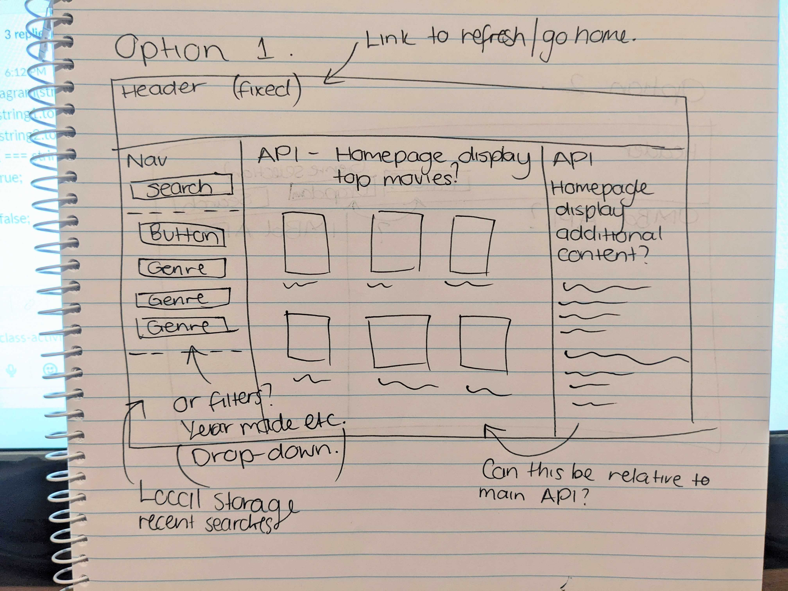

# YouTrailer
## User Story

AS A person who enjoys discovering and watching entertainment, 

I WANT TO be able to search for entertainment and view trailers

SO THAT I can decide what I would like to watch or play next.

# About YouTrailer

YouTrailer is a library of trailers for different types of entertainment, whether it is movies, tv shows, video games or other sources of video entertainment. 

The site is used to browse movies by category, year of release and rating, or by title that you are searching for (can even search without a title).

So users can find movies according to desired search and view the trailer.

## How YouTrailer built 🛠 

# Mock

   

# Tools used
   
    🔗 HTML
    
    🔗 CSS 

    🔗 Bulma
    
    🔗 Javascript

    🔗 JQuery

    // Libraries used,

        - Jquery (https://jquery.com/)

        - IMDb API (https://imdb-api.com/api)

        - YouTube API (https://cloud.google.com/)

        - FontAwesome (https://fontawesome.com/start)

    // Framework - Bulma (https://bulma.io/)

    // Other Sources used,

        - Google (https://www.google.com/)

// YouTrailer was developed to give maximum user friendliness to the browser. The site is designed with multiple filters for the best user accessibility. Features and functionalities as follows;

# Features of,

    @ Search section -  

    This is the section where user can enter the title of the desired entertainment and click the search button and the main page will show all the relevant entertainment selections similar to the title entered.  

    @ Search History - 

    Search history is designed to save browser time. Once the user input the title of their entertainment, it stores in the search bar. So user can easily search the same name of the movie without re-entering into the search bar.  

    @ Choosing the Genre -

    User also can search the trailer by choosing a Genre. This is, if the user wants to search the same title and also can be searched by the category. This option has been designed due to some other entertainment related to multiple categories.

    Ex:

    @ Year of Made -

    If there's a series of entertainment under one title which are released in different years, the user can search the particular title by year of released and get the filtered results.

    Ex:

    @ Rating -

    Browser can filter the searched results by choosing the range of the rating 1 to 10.

# Functionalities of,

    @ Search Section -
 
    In this section, the titles the user has selected has been saved within the local storage using the JSON stringify and parse functions. 

    When the browser is refreshed the history list will be presented due to the function of parsing the local storage and it is present on the User Interface (UI). 

    @ API -
    
    Clicking on the title in the history section calls on the youtube API to receive the URL and creates a youtube video player on the main screen.
   
    The search section also triggers the API call by inputting the search name into the API request url. When the user clicked a title it will be stored within a variable and then stored within the local storage using stringify. 

# Obstacles 🤔

    - Git command failures

    - Git merging failures

    - Imdb errors

    - API key validation period

    - YouTube API key validation period

    - Bulma coding pattern

# Authors

    - Ben (HTML, CSS, JavaScript & API)

    - Roman (HTML, CSS, JavaScript & API)

    - Caroline (Sketch, HTML & CSS)

    - Chamath (HTML, README) 

⚡️ Fun fact...

Thank you for the Developers for making us Developers!

## Deployed URL
https://carolinemae.github.io/YouTrailer/ 